# Vision

Vision is a GPU physically based renderer,
The vision renderer uses embeded DSL codegen technology derived from luisa
compute https://github.com/LuisaGroup/LuisaCompute, which is a great invention!

### Program feature

| Feature      | Progress |
|--------------|----------|
| Render Graph | Doing    |
| Shader Graph | Done     |
| Hot fix      | Done     |

### Editor

| Feature           | Progress |
|-------------------|----------|
| ImGUI             | Done     |
| Material edit     | Done     |
| Light edit        | Done     |
| Scene edit        | Planned  |
| Graph edit        | Planned  |
| Save data to file | Planned  |

### Render algorithm

| Feature                    | Progress   |
|----------------------------|------------|
| Megakernel path tracing    | Done       |
| ReSTIR DI                  | Done       |
| ReSTIR GI                  | doing(80%) |
| Surfel                     | Planned    |
| Light probe                | Planned    |
| Wavefront path tracing     | Planned    |
| Bidirectional path tracing | Planned    |
| Photon mapping             | Planned    |

### Render mode

| Feature          | Progress   |
|------------------|------------|
| Offline render   | Done       |
| Real time render | Planned    |
| Lightmap bake    | Doing(75%) |

### Reconstruction Filters

| Feature                      | Progress |
|------------------------------|----------|
| Filter Importance Sampling   | Done     |
| Mitchell-Netravali Filter    | Done     |
| Box Filter                   | Done     |
| Triangle Filter              | Done     |
| Gaussian Filter              | Done     |
| Lanczos Windowed Sinc Filter | Done     |

### Materials

| Feature   | Progress |
|-----------|----------|
| metal     | Done     |
| matte     | Done     |
| glass     | Done     |
| mirror    | Done     |
| substrate | Done     |
| disney    | Done     |
| hair      | Planned  |
| BSSRDF    | Planned  |

### Color

| Feature           | Progress |
|-------------------|----------|
| SRGB              | Done     |
| Complete spectrum | Done     |

### Tone mapping

| Feature  | Progress |
|----------|----------|
| Linear   | Done     |
| ACES     | Done     |
| Reinhard | Done     |

### Denoise

| Feature | Progress |
|---------|----------|
| OIDN    | Done     |
| OptiX   | Planned  |
| NRD     | Planned  |

### Sensor

| Feature           | Progress |
|-------------------|----------|
| Pinhole Cameras   | Done     |
| Thin-Lens Cameras | Done     |
| Realistic Cameras | Planned  |
| Fish-Eye Cameras  | Planned  |

### Illumination

| Feature                                       | Progress |
|-----------------------------------------------|----------|
| Area Lights, emission                         | done     |
| projector                                     | done     |
| spotlight                                     | done     |
| pointlight                                    | done     |
| HDRI Environment Maps                         | done     |
| Portal Environment Maps                       | Planned  |
| IES                                           | Planned  |
| Uniform-Distribution Light Selection Strategy | done     |
| Power-Distribution Light Selection Strategy   | done     |
| BVH Light Selection Strategy                  | Planned  |

### Backends

| Feature | Progress                 |
|---------|--------------------------|
| GPU     | Done (with CUDA + OptiX) |
| DirectX | Planned                  |
| Vulkan  | Planned                  |

### Exporter/Importer

| Feature | Progress   |
|---------|------------|
| Blender | Doing(90%) |
| 3DS Max | Planned    |

Part of the scene comes from https://benedikt-bitterli.me/resources/

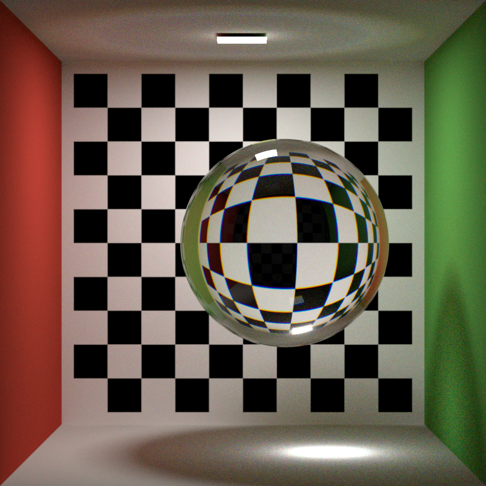
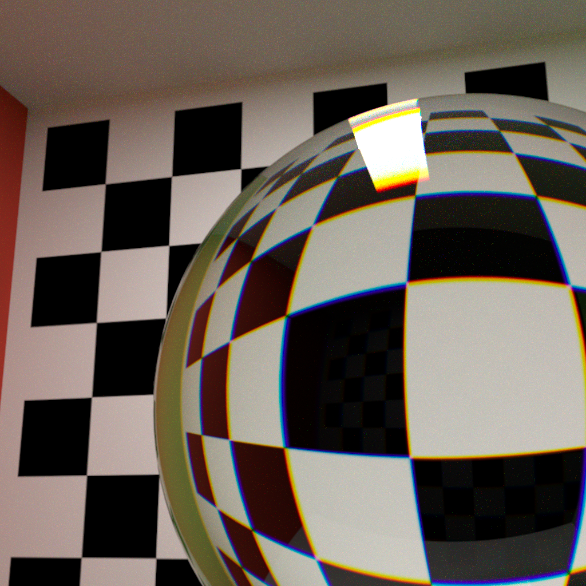
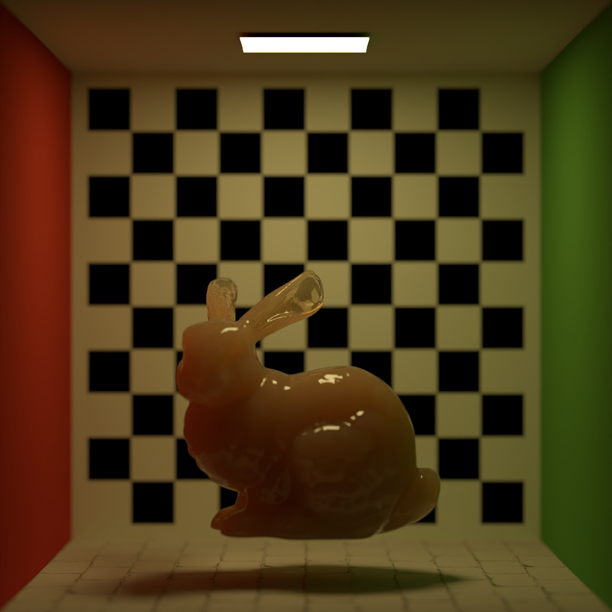
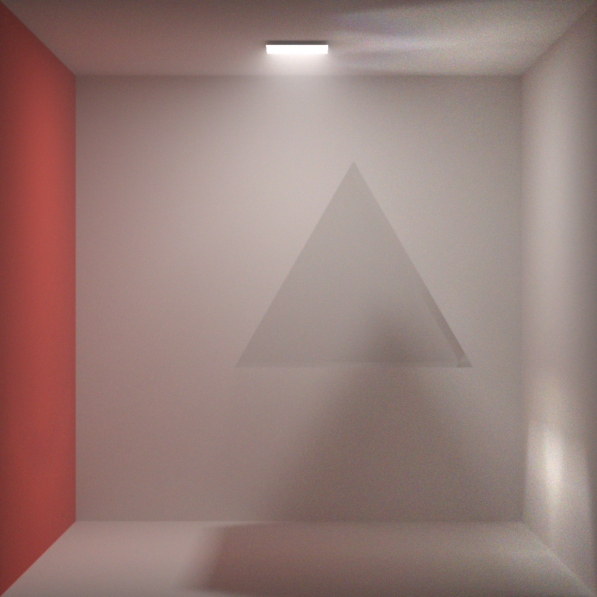
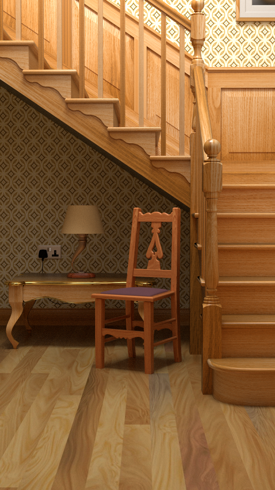

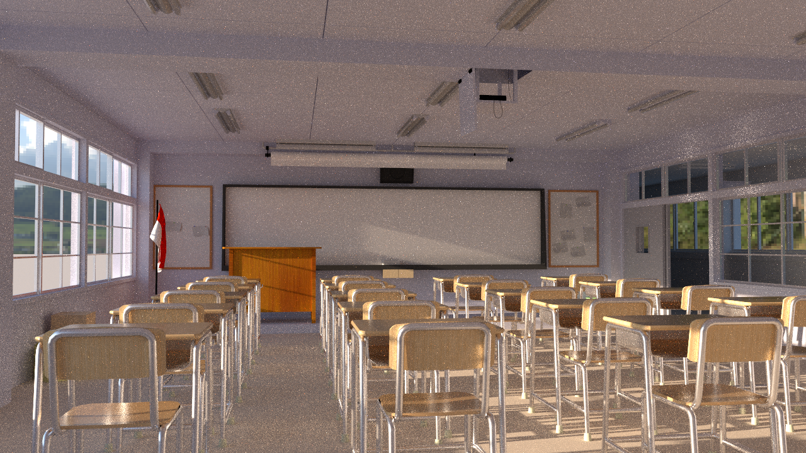

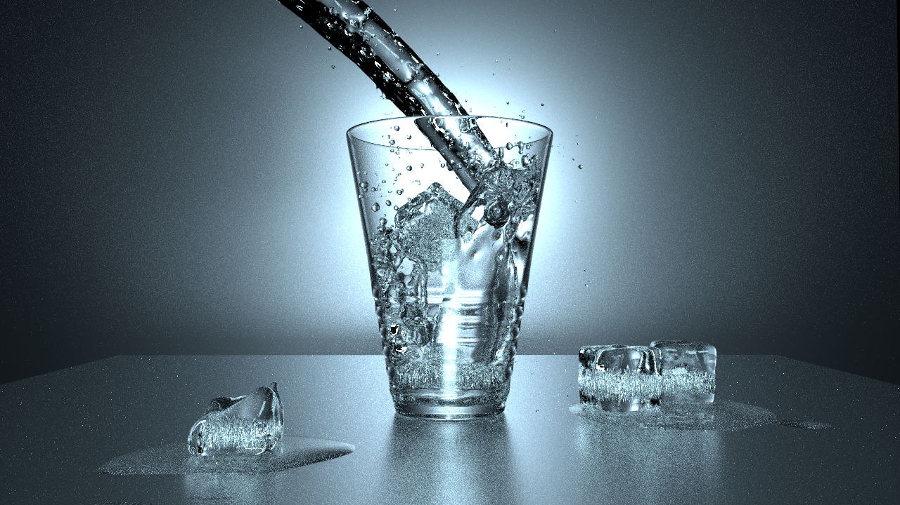
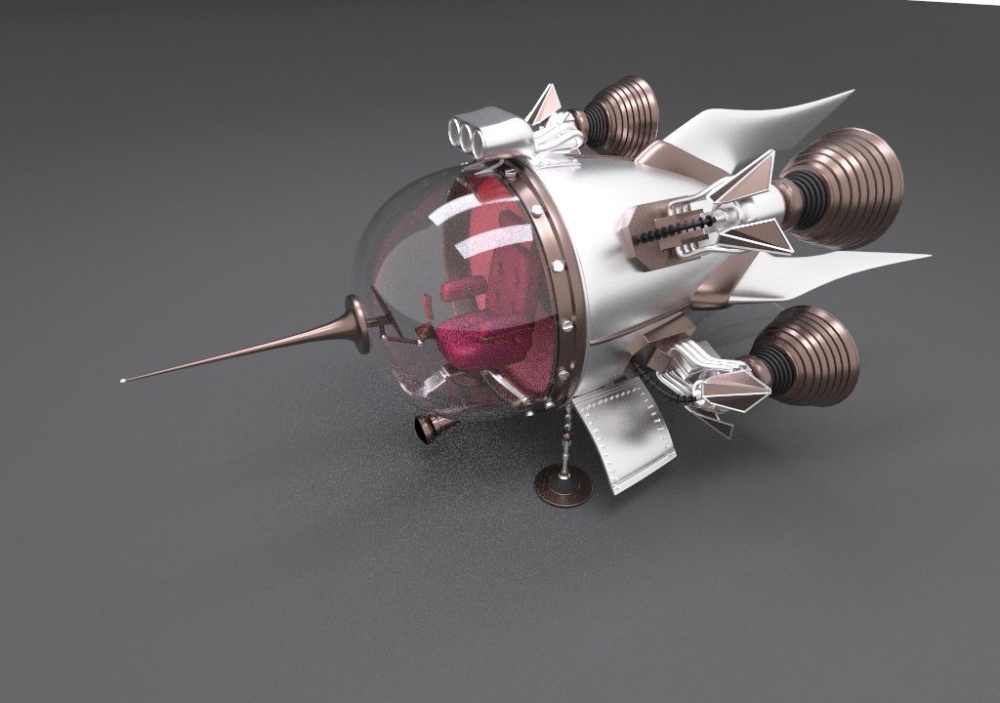
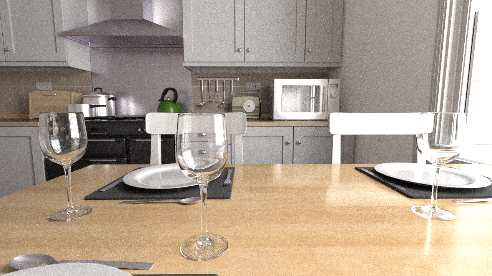

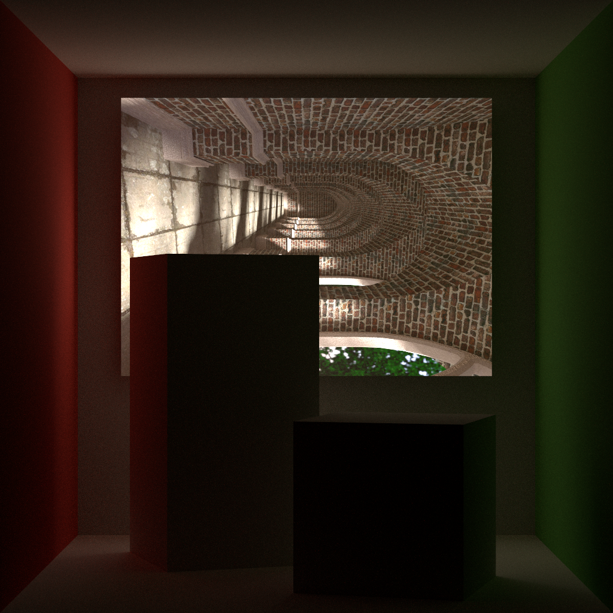
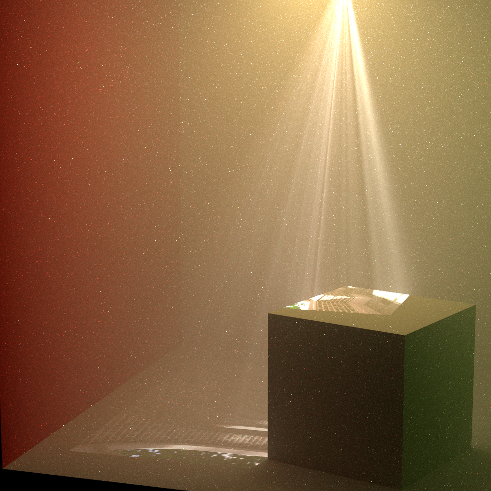

-s ..\..\res\render_scene\cbox\vision_scene.json
